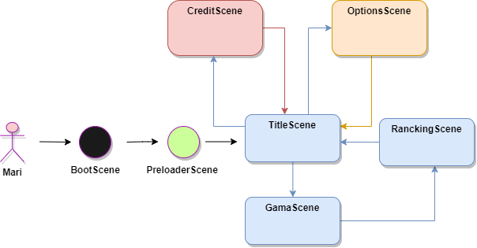

# LostDimy

## Visão geral

LostDymi é um jogo no qual o jogador controla um pinguim que precisa atravessar um percurso imprevisível e bastante irregular por meio de saltos. Apresentando seu trajeto em plataforma 2D, e preciso pressionar o botão esquerdo do mouse para regular o grau de impulsão dos saltos, recebendo pontos por cada elevação alcançada.

## Interações com o jogo

A interação do jogo acontece da seguinte forma, o personagem vai se movimentando entre os blocos do cenário pressionando  o botão esquerdo do mouse, se movendo sempre para a direita, por meio da ação pular. 

## Sistema de pontuação

Os pontos são acumulados quando o personagem salta e cai sobre a próxima plataforma, a cada salto correto o score adiciona em 2 pontos podendo ser acrescentado pontos extras por cada sequência de blocos realizada. 

## Requisitos

#### Épicos/Funcionalidades

1. **Exibir tela de abertura com opção de menu**

   A aplicação exibe uma tela de abertura com opções de menu, contendo ajuda com  informações do game e iniciar partida

2. **Desenvolver  a tela principal do jogo**

   A aplicação exibe uma tela contendo o personagem sobre uma plataforma, podendo saltar para as próximas, aplicando uma quantidade força através do toque no direcinal do pc, tambem possue um botção para voltar para menu 

3. **Exibir tela de ranking**

   A aplicação exibe na tela principal, os pontos obtidos na partida e a maior pontuação alcançada no jogo.

**Personas**
Mari - usuário com acesso a um navegador web, que gosta de jogar games no computador.

## Protótipos de Tela

